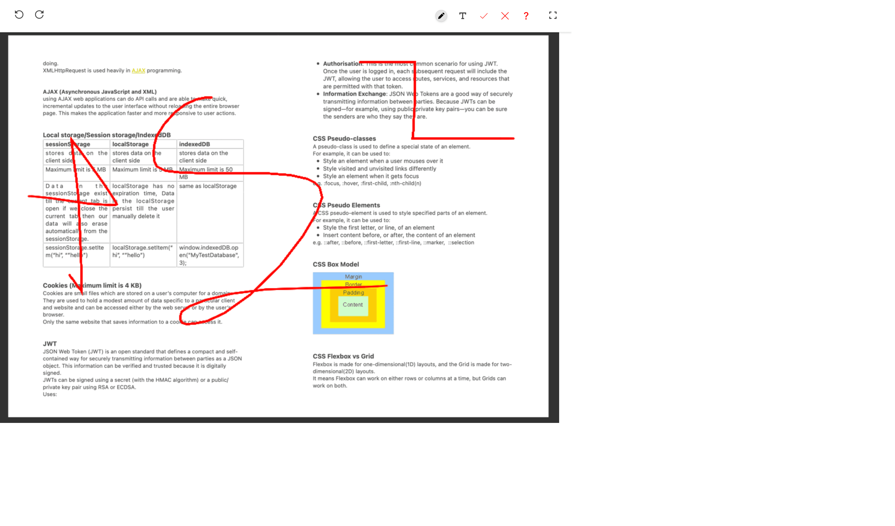
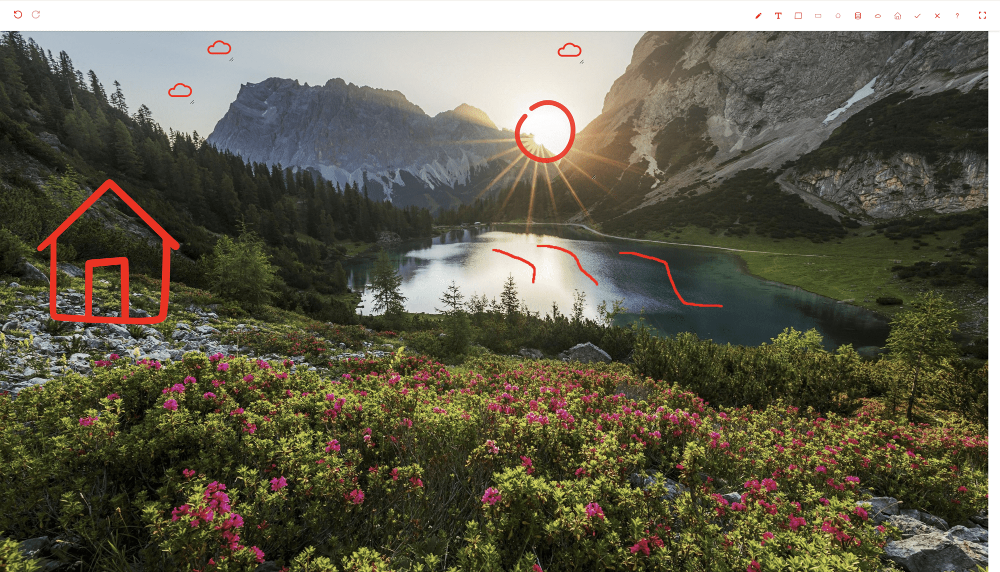
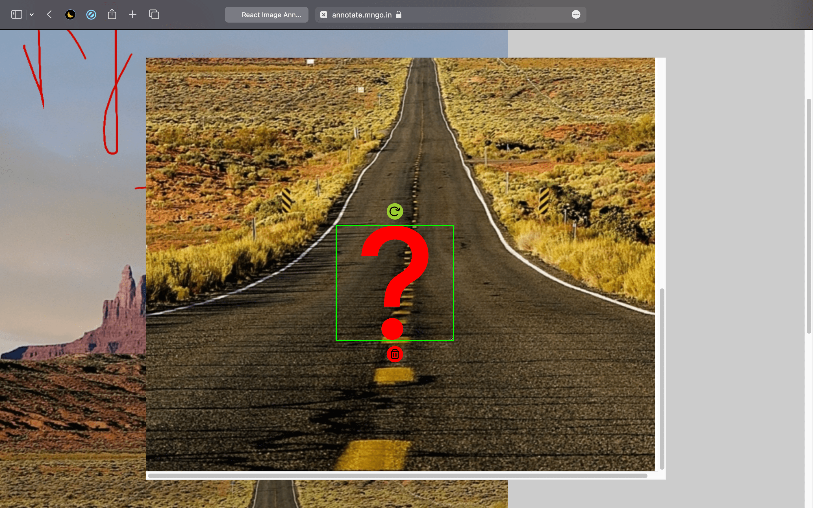

# react-image-annotate-mngo
This library is available at [react-image-annotate-mngo](https://www.npmjs.com/package/react-image-annotate-mngo)

## Demo
[annotate.mngo.in](https://annotate.mngo.in)

## Brief:

A JavaScript React Library (npm package ) which provides an area over an image to annotation/markup/write.
One can easily annotate over image in react.js by installing `react-image-annotate-mngo` package

## Screenshots:

## Usage
    <MNgoImageAnnotate
        compIdx={number}
        image={string | Image}
        loc={number[]}
        width={number}
        loader={string | ReactElement}
        error={string | ReactElement}
        textInputField={(textInputVal: string, setTextInputVal: Dispatch<SetStateAction<string>>) => ReactElement}
        shapes={{ [key: string]: any }}
        annotations={any[]}
        onChange={(data: { [key: string]: any }) => void}
    />

`props example`

1. `compIdx`  unique index of the component when using `MNgoImageAnnotate` multiple time in view/screen/oage
2. `image`  image of type JS Image object or image url/link, e.g. [https://tinypng.com/images/social/website.jpg](https://tinypng.com/images/social/website.jpg)
3. `loc`  loc represents co-ordinates of visible portion of the image, i.e. [x1, y1, x2, y2]
4. `width`  width of the image, default value is 900
5. `loader`  ReactElement or string to display while image is loading/downloading, default value is "loading"
6. `error`  ReactElement or string to display when image could not be loaded, default value is "something went wrong"
7. `textInputField`  a function to render Text Tool Input Field
        e.g.

            function (textInputVal, setTextInputVal) => {
                return (
                    <textarea
                        autoFocus
                        className="sa-h-[50px] sa-w-[95%] sa-resize-none sa-border-[lightgrey] sa-shadow-md sa-rounded-md"
                        value={textInputVal}
                        onChange={(e) => setTextInputVal(e.target.value)}
                    />
                )
            }

8. `shapes`  shape button in tool bar

            {
                <shape type | title>: { btnIcon: <string | Image>, img: <string | Image> },
            }

        e.g.

            {
                tick: { btnIcon: tickShape, img: tickShape },
                cross: { btnIcon: crossShape, img: crossShape },
            }

9. `annotations` array of annotations present on the image

            [
                {
                    "type": <shape type or title>,
                    "pos": { "x": number, "y": number },
                    "size": { "height": number, "width": number },
                },
                {
                    "type": "pencil,
                    "pts": [number, number][],
                },
                {
                    "type": "pencil,
                    "pos": { "x": number, "y": number },
                    "size": { "height": number, "width": number },
                    "html": string,
                }
            ]

        e.g.

            [
                {
                    "type": "cross",
                    "pos": { "x": 757, "y": 224 },
                    "size": { "height": 50, "width": 50 },
                },
                {
                    "type": "pencil",
                    "pts":[ [878,96],[878,98],[878,102],[878,122],[878,168],[874,224],[872,281],[872,331],[872,363] ],
                },
                {
                    "type": "pencil",
                    "pos": { "x": 408, "y": 115 },
                    "size": { "height": 62 , "width": 126},
                    "html": "hello world",
                }
            ]

10. `onChange`  callback function run when any change is done on annotations

        onChange (annotationData: object) => void

        `annotationData` is { width: number, annotations: annotations[]}

## Installation

1. npm install
2. npm start

## Available Scripts

In the project directory, you can run

### `npm start`

Runs the app in the development mode
Open [http://localhost:3000](http://localhost:3000) to view it in the browser.

### `npm run babel-build`

it is for final package build which create `dist` folder.

### `npm publish`

to publish the project on npm

`Note`: do `npm run babel-build` before `npm publish` because it publishes dist folder as defined as key main, module, files in package.json, and do not forget to login in npm using `npm login`

### `npm run build-publish`

this command make build of the project and publishes it, basically it is combination of `npm run babel-build` and `npm publish`

## License

All rights reserved under MNgo.
